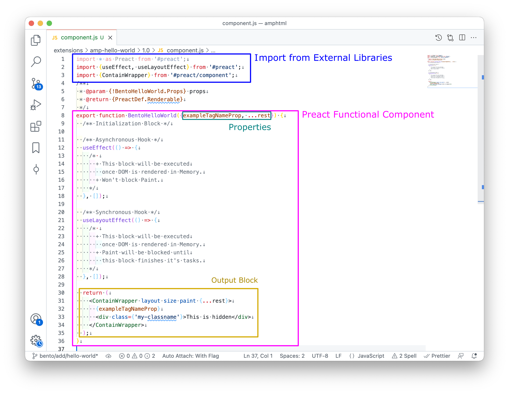
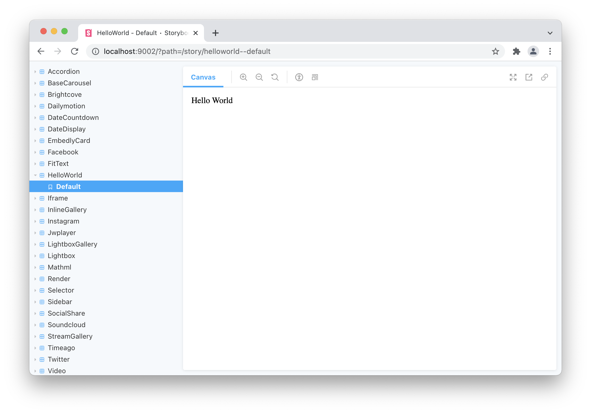

# Example 1: Hello World

Setup for development is covered in [previous tutorial](./setup.md). In this example, you will walk through a step-by-step guide to create, write and test your first `Hello World` Bento Component.

> Objectives:
>
> -   Create new Component
> -   Write "Hello World"
>     -   Static Render
> -   Test Component

## Create

Let's create a new Bento Component:

```shell
amp make-extension --bento --name=hello-world --nojss --nocss
```

Argument explanation:

-   `make-extension`: Create an extension
-   `--bento`: Instructs `make-extension` to create a Bento extension
-   `--name`: Give unique name to your extension
-   `--nojss`: Do not add JSS (required only for styling)
-   `--nocss`: Do not add JSS (required only for styling)

In context of this example, we do not need styling and thus `--nojss` & `--nocss` are added to the argument list.

> Explore full list of available commands for `make-extension` by
>
> ```shell
> amp make-extension --help
> ```

### Understand Directory Structure

Creating new component will generate `amp-hello-world`:


Before going ahead, let's understand basics of directory structure:

-   Here, `storybook` directory provides environment to test out your Bento component into AMP and Preact environment without creating HTML page.
    -   `Basic.amp.js` provides test environment for AMP while `Basic.js` provides test environment for Preact Component.
-   `test` contains file for unit testing AMP and Preact component.
    -   `test-amp-hello-world.js` is for AMP unit-testing test while `test-component.js` is for Preact unit-test.
-   `amp-hello-world.js` is your starting point for AMP Environment.
-   `base-element.js` is your AMP-Preact Bridge.
-   `component.js` is Preact Implementation for Component.
-   `component.type.js` defines type-definition for Preact Component.

> To read more about directory structure, please [refer this guide](https://github.com/ampproject/amphtml/blob/main/docs/building-a-bento-amp-extension.md#directory-structure).

## Write "Hello World" Example

Goal of this example is to render (or show) `Hello World` in the browser.

Before writing example, let's understand basic structure of a Preact Functional Component. Open `component.js` and refer this figure:



As seen in above figure, a Bento Component is simply a Preact Functional Component. A Preact Functional Component takes properties (and component reference as optional) as parameter(s) and return Preact Element in JSX.

> Please refer [PreactJs: Functional Components](https://preactjs.com/guide/v10/components#functional-components) for more information.

Let's get back to example. To show `Hello World`, it should be return from Preact Functional Component as:

```diff
import * as Preact from '#preact';
import {
  useCallback,
  useEffect,
  useLayoutEffect,
  useMemo,
  useRef,
  useState,
} from '#preact';
import {ContainWrapper} from '#preact/component';

import {useStyles} from './component.jss';

/**
 * @param {!BentoHelloWorld.Props} props
 * @return {PreactDef.Renderable}
 */
export function BentoHelloWorld({exampleTagNameProp, ...rest}) {
  // Example of state and hooks
  // DO NOT SUBMIT: This is example code only.
  const [exampleValue, setExampleValue] = useState(0);
  const exampleRef = useRef(null);
  const styles = useStyles();

  useCallback(() => {
    /* Do things */
  }, []);
  useEffect(() => {
    /* Do things */
  }, []);
  useLayoutEffect(() => {
    /* Do things */
  }, []);
  useMemo(() => {
    /* Do things */
  }, []);

  return (
    <ContainWrapper layout size paint {...rest}>
+     Hello World
      {exampleTagNameProp}
      <div class={`${styles.exampleContentHidden}`}>This is hidden</div>
    </ContainWrapper>
  );
}
```

Let's remove unnecessary code to make it simple to understand:

```javascript
import * as Preact from '#preact';
import {ContainWrapper} from '#preact/component';

/**
 * @param {!BentoHelloWorld.Props} props
 * @return {PreactDef.Renderable}
 */
export function BentoHelloWorld({...rest}) {
  return (
    <ContainWrapper layout size paint {...rest}>
      Hello World
    </ContainWrapper>
  );
}

```

Now, it is much cleaner to understand. Upon calling `BentoHelloWorld`, it will render `Hello World` on the scree.

> **What is `ContainWrapper`?**
>
> The wrapper component that implements different "contain" parameters. This most often indicates that the element's size doesn't depend on its children (e.g. `contain:size`), but there might be other variances as well.
>
> For more information, visit: https://developer.mozilla.org/en-US/docs/Web/CSS/contain

## Test

To test a Bento Component, storybook is provided. There are two types of storybook testing environment:

1. AMP Test Environment
2. Preact Functional Test Environment

Let's test component by:

`amp storybook`

You will see two storybook page:

-   One with `9001` port which is AMP Test Environment
    -   When this tutorial was written, AMP Storybook was disabled. Refer this PR for recent status: [#36780](https://github.com/ampproject/amphtml/pull/36780)
-   Second with `9002` port which is Preact Component Test Environment



## Summary

In this example, you walked through creating and testing first `Hello World` Bento Component. Explore an interactive greetings example in next tutorial.

<hr/>
<a href="example-2-greetings.md">Next: Example 2 - Greetings</a>
