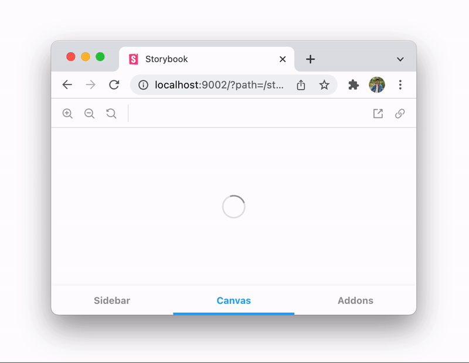

# Example 3: Counter

[Example 2](./example-2-greetings.md) covered basics differences between `useEffect` and `useLayoutEffect`. In this example, you will learn dynamically calling a function using `useCallback`.

## Syntax

```jsx
const functionCallback = useCallback(( functionParameters ) => {
    /* Function Body */
}, [ functionDependencies ]);
```

`useCallback` will return a memoized version of the callback that only changes if one of the dependencies has changed. This is useful when passing callbacks to optimized child components that rely on reference equality to prevent unnecessary renders.

Refer [reactjs Documentation](https://reactjs.org/docs/hooks-reference.html#usecallback) for more information.

Goal of the example is to create a component with two buttons increment, decrement and a lable to show current value of the counter as:



Based on above demo, example can be divided into:

1. Render Block

    ```html
     <span style={{'margin': 10}}>
         <button onClick={incrementCounter}>+</button>
     </span>
     <span style={{'margin': 10}}>{counterValue}</span>
     <span style={{'margin': 10}}>
         <button onClick={decrementCounter}>-</button>
     </span>
    ```

2. Component Logic

    ```jsx
    /** State Variables */
    const [counterValue, setCounterValue] = useState(0);

    /**
     * Increment `counterValue` by one.
    */
    const incrementCounter = useCallback(() => {
        // Update `counterValue` state with new value
        setCounterValue(counterValue + 1);
    }, [counterValue]);

    /**
     * Decrement `counterValue` by one.
    */
    const decrementCounter = useCallback(() => {
        // Update `counterValue` state with new value
        setCounterValue(counterValue - 1);
    }, [counterValue]);
    ```

Complete sourcecode of `component.js` should look like:

```jsx
import * as Preact from '#preact';
import {useCallback, useState} from '#preact';
import {ContainWrapper} from '#preact/component';

/**
 * @param {!BentoCounter.Props} props
 * @return {PreactDef.Renderable}
 */
export function BentoCounter({...rest}) {
  /** State Variables */
  const [counterValue, setCounterValue] = useState(0);

  /**
   * Increment `counterValue` by one.
   */
  const incrementCounter = useCallback(() => {
    // Update `counterValue` state with new value
    setCounterValue(counterValue + 1);
  }, [counterValue]);

  /**
   * Decrement `counterValue` by one.
   */
  const decrementCounter = useCallback(() => {
    // Update `counterValue` state with new value
    setCounterValue(counterValue - 1);
  }, [counterValue]);

  return (
    <ContainWrapper layout size paint {...rest}>
      <span style={{'margin': 10}}>
        <button onClick={incrementCounter}>+</button>
      </span>
      <span style={{'margin': 10}}>{counterValue}</span>
      <span style={{'margin': 10}}>
        <button onClick={decrementCounter}>-</button>
      </span>
    </ContainWrapper>
  );
}
```

## Summary

In this example, you walked through how to utilise dynamic function calling using `useCallback`. In [next tutorial](example-4-currency-converter.md), you will learn about attribute mapping and stylign of the Bento Component.
